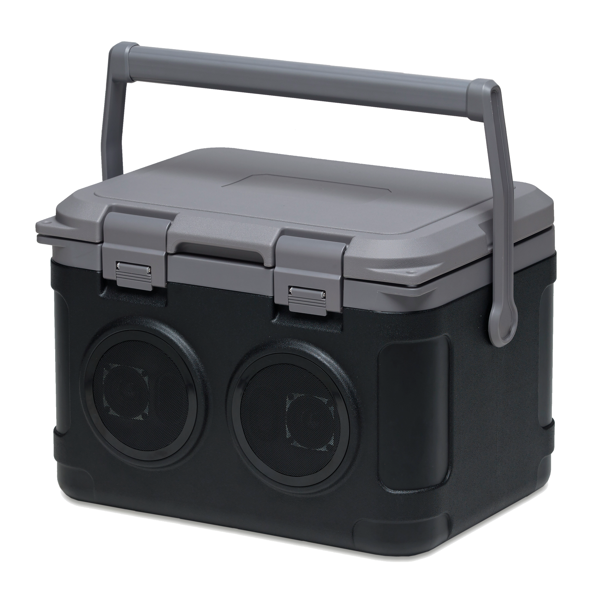

# SoundBox

A local sound library browser. Fuzzy search, waveform display, region audition,
and renaming

Never modifies audio content. Renaming a file on disk is the only write it performs,
and only when you ask for it.

## Features

- Fuzzy search across your whole library, per keystroke
- Waveform view with click-and-drag region audition
- Loudness (EBU R128) and peak dB per file
- "Find similar" based on audio features
- Safe rename with an undo log
- Multiple library roots, grouped into profiles
- Live updates when files change on disk

Formats: wav, flac, mp3, ogg, aac, aiff.

## Install

Grab the latest installer from the [Releases](https://github.com/Sirsyorrz/SoundBox/releases)
page. Windows and Linux builds are provided; macOS is best-effort.

## Build from source

Requires Node 20+ and a Rust toolchain, plus the
[Tauri v2 prerequisites](https://v2.tauri.app/start/prerequisites/) for your OS.

```bash
npm install
npm run tauri dev      # development
npm run tauri build    # installers in src-tauri/target/release/bundle
```

`./run.sh` builds and runs a release binary directly, without packaging.

## Stack

Tauri v2 + React/TypeScript on the front, Rust on the back: `symphonia` for
decoding, `cpal` for playback, `nucleo` for search, `rusqlite` for metadata.

See [PLAN.md](PLAN.md) for the full architecture.
